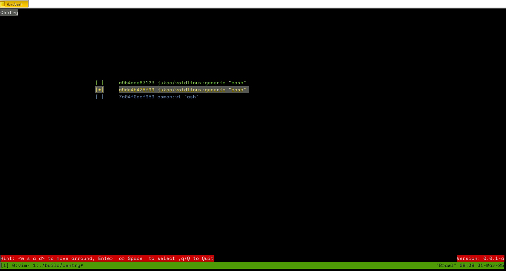

# CENTRY 

### What is Centry 

Centry is a simple, lightweight program that lets you access the inside of a running Docker container just like in interactive tty mode. 
The only prerequisite is to have Docker already available on your system. 

### Quick demo 
```bash 
#  center  <short-id-container{2-3}> 
```
Exemple : 
```bash 
$> docker ps 
CONTAINER ID   IMAGE                     COMMAND           CREATED        STATUS        PORTS     NAMES
c3784c6459b9   <image>                   "sleep 9999999"   24 hours ago   Up 24 hours            festive_ramanujan
-------------------------------------------------------------------------------------------------------------------

#> center c37   
```
However ,If no arguments are supplied , an interface (TUI) will be proposed, allowing you to choose your target use <WASD> to move up and down 

 

### COMPILE 
**We strongly recommend using the [Meson Build System](https://mesonbuild.com/) to build the project.** 

```bash 
$>  meson setup build 
$>  meson compile -C build 
$>  meson install -C build  #To install localy 
``` 

To uninstall 
```bash 
#> ninja uninstall -C build 
```  

#### NOTE : 
If you notice any problems, please open a case and we will be happy to correct them. If you have the opportunity to do so, we encourage you to submit a PR. 
Thank you in advance for your cooperation. 

Appreciate Computer at all levels 
